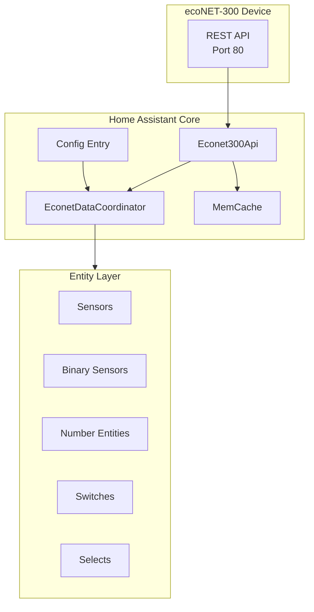
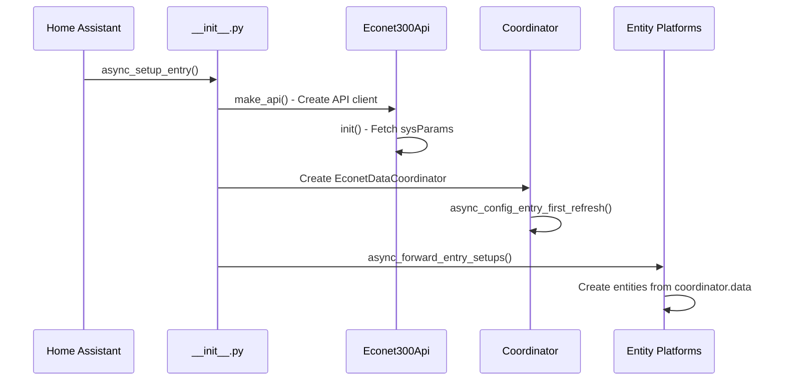
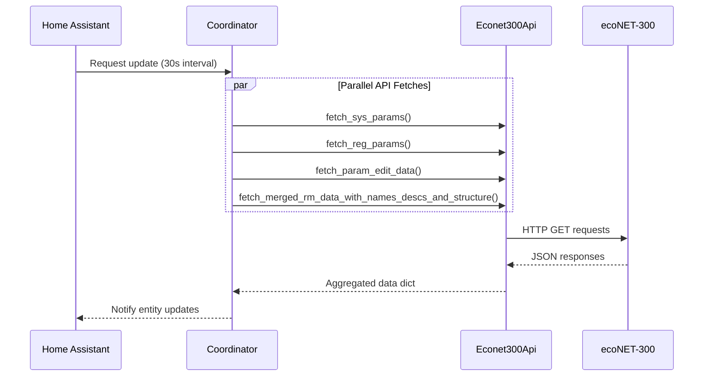
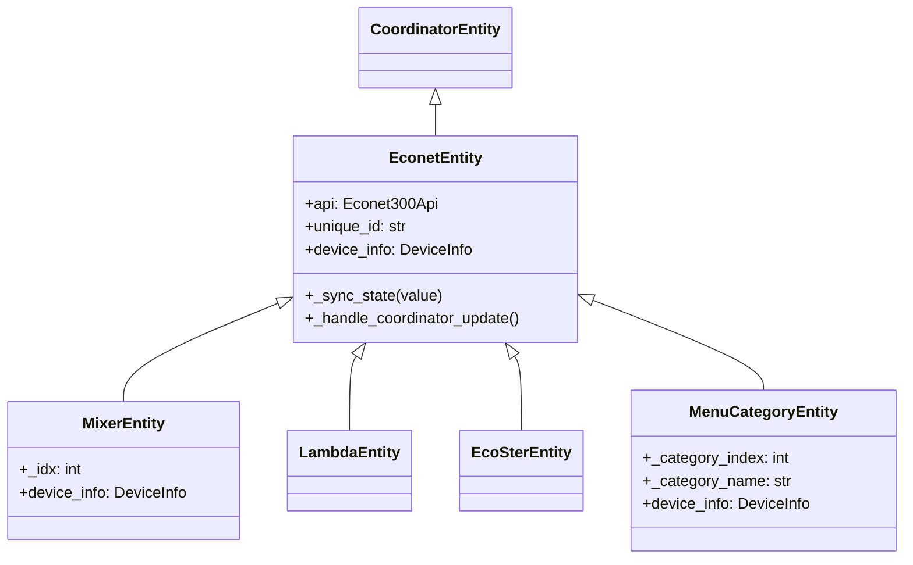
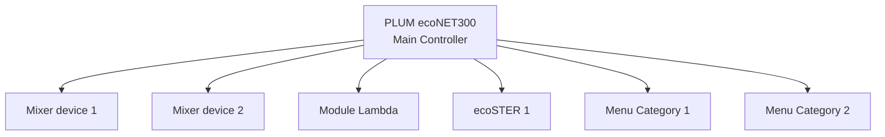
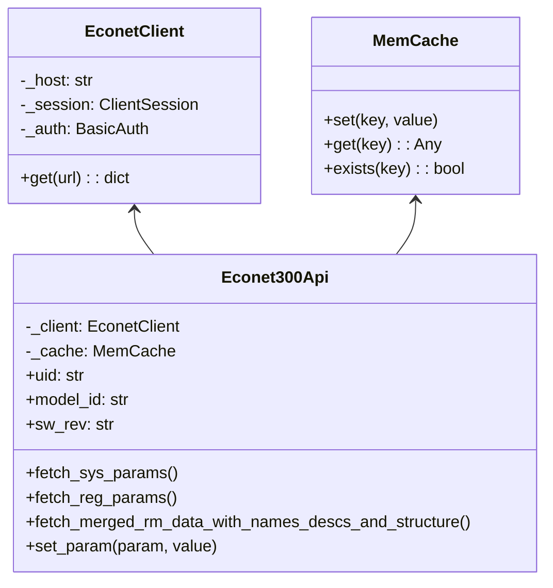
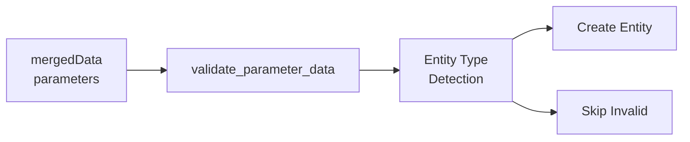

# ecoNET-300 Integration Architecture

This document provides a high-level overview of the ecoNET-300 Home Assistant integration architecture for AI agents and developers.

## System Overview



## Integration Lifecycle

The integration follows Home Assistant's standard setup pattern:



**Key Files:**
- `__init__.py` - Entry point, orchestrates setup
- `config_flow.py` - User configuration UI
- `api.py` - API client and data fetching
- `common.py` - Coordinator implementation

## Data Sources

The coordinator aggregates data from multiple API endpoints into a unified structure:

| Data Key | API Endpoint | Purpose |
|----------|--------------|---------|
| `sysParams` | `/econet/sysParams` | Device info, firmware versions, network status |
| `regParams` | `/econet/regParams` | Current sensor values (temperatures, power, status) |
| `paramsEdits` | `/econet/rmCurrentDataParamsEdits` | Editable parameter limits (min/max) |
| `mergedData` | Multiple `rm*` endpoints | Unified parameter data for dynamic entities |
| `rmData` | Multiple `rm*` endpoints | Raw RM endpoint data (names, enums, structure) |

### Coordinator Data Structure

```python
coordinator.data = {
    "sysParams": {...},      # System parameters
    "regParams": {...},      # Register parameters (sensor values)
    "regParamsData": {...},  # Register parameter metadata
    "paramsEdits": {...},    # Editable parameter limits
    "rmData": {...},         # Raw RM endpoint data
    "mergedData": {          # Unified dynamic entity data
        "parameters": {
            "0": {"name": "...", "value": ..., "edit": True, ...},
            "1": {"name": "...", "value": ..., "enum": {...}, ...},
            ...
        }
    }
}
```

## Coordinator Pattern

The `EconetDataCoordinator` polls the device every 30 seconds:



**Key Features:**
- 30-second polling interval
- Parallel API fetches for performance
- Error handling with `ConfigEntryAuthFailed` and `UpdateFailed`
- Controller-specific endpoint support detection

## Entity Architecture

### Base Class Hierarchy



### Entity Types

| Entity Class | File | Purpose |
|--------------|------|---------|
| `EconetSensor` | `sensor.py` | Temperature, power, status sensors |
| `EconetBinarySensor` | `binary_sensor.py` | Pump/fan working, connectivity |
| `EconetNumber` | `number.py` | Temperature setpoints |
| `EconetSwitch` | `switch.py` | Boiler ON/OFF control |
| `EconetSelect` | `select.py` | Mode selection (Winter/Summer/Auto) |

### Device Hierarchy



## Dynamic Entity System

Dynamic entities are created from `mergedData` at runtime, allowing the integration to adapt to different controller configurations.

### Data Merging Process

The `fetch_merged_rm_data_with_names_descs_and_structure()` method combines:

1. `rmParamsData` - Base parameter metadata (value, min, max, edit, unit)
2. `rmParamsNames` - Human-readable names
3. `rmParamsDescs` - Parameter descriptions
4. `rmStructure` - Menu structure and parameter numbers
5. `rmParamsEnums` - Enumeration values for select/switch entities
6. `rmParamsUnitsNames` - Unit symbols (°C, %, kW)
7. `rmCatsNames` - Category names for device grouping
8. `rmLocksNames` - Lock reason messages

### Entity Type Detection

Parameters from `mergedData` are classified into entity types:

```
Parameter from mergedData
    │
    ├─ edit=False OR locked=True → SENSOR (read-only)
    │
    ├─ has enum (2 options, binary pattern) → SWITCH
    │
    ├─ has enum (3+ options) → SELECT
    │
    └─ has unit_name + valid min/max → NUMBER
```

**Detection Functions** (in `common_functions.py`):

| Function | Purpose |
|----------|---------|
| `should_be_read_only_sensor()` | Check if parameter is read-only |
| `should_be_switch_entity()` | Check for binary enum (ON/OFF) |
| `should_be_select_entity()` | Check for multi-option enum |
| `is_parameter_locked()` | Check device-side lock status |
| `validate_parameter_data()` | Validate parameter completeness |

## API Layer

### Class Structure



### API Endpoints

**Core Endpoints:**
- `GET /econet/sysParams` - System configuration
- `GET /econet/regParams` - Current values
- `GET /econet/regParamsData` - Parameter metadata

**RM (Remote Menu) Endpoints:**
- `GET /econet/rmParamsData` - Parameter definitions
- `GET /econet/rmParamsNames?lang=en` - Translated names
- `GET /econet/rmParamsEnums?lang=en` - Enum values
- `GET /econet/rmStructure` - Menu structure
- `GET /econet/rmCurrentDataParams` - Real-time data

**Write Endpoints:**
- `GET /econet/newParam?newParamName=X&newParamValue=Y` - Control params
- `GET /econet/rmCurrNewParam?newParamKey=X&newParamValue=Y` - Number params
- `GET /econet/rmNewParam?newParamIndex=X&newParamValue=Y` - Special params

## Validation Layer

The validation layer ensures data integrity before entity creation:



**Validation Checks:**
- Required fields (key, name)
- Numeric range validity (min < max)
- Enum structure completeness
- Lock status handling

## Key Files Reference

| File | Purpose |
|------|---------|
| `__init__.py` | Entry point, setup/unload lifecycle |
| `api.py` | API client, data fetching and merging |
| `common.py` | Coordinator implementation |
| `common_functions.py` | Validation and utility functions |
| `entity.py` | Base entity classes |
| `const.py` | Constants, mappings, device classes |
| `sensor.py` | Sensor entity implementations |
| `binary_sensor.py` | Binary sensor implementations |
| `number.py` | Number entity implementations |
| `switch.py` | Switch entity implementations |
| `select.py` | Select entity implementations |

## Related Documentation

- **[API_V1_DOCUMENTATION.md](API_V1_DOCUMENTATION.md)** - Complete API endpoint reference
- **[DYNAMIC_ENTITY_VALIDATION.md](DYNAMIC_ENTITY_VALIDATION.md)** - Detailed validation layer docs
- **[BOILER_CONTROL_README.md](BOILER_CONTROL_README.md)** - Boiler control implementation
- **[devices/](devices/)** - Device-specific documentation

## Controller Compatibility

Different controllers support different API endpoints:

| Controller | paramsEdits | rm* Endpoints | Dynamic Entities |
|------------|-------------|---------------|------------------|
| ecoMAX810P-L | Yes | Yes | Full support |
| ecoMAX850R2-X | Yes | Yes | Full support |
| ecoMAX360 | No | Yes | Limited |
| ecoSOL500 | No | Partial | Limited |
| SControl MK1 | No | Partial | Limited |

The `skip_params_edits()` function in `common.py` handles controller-specific endpoint support.

